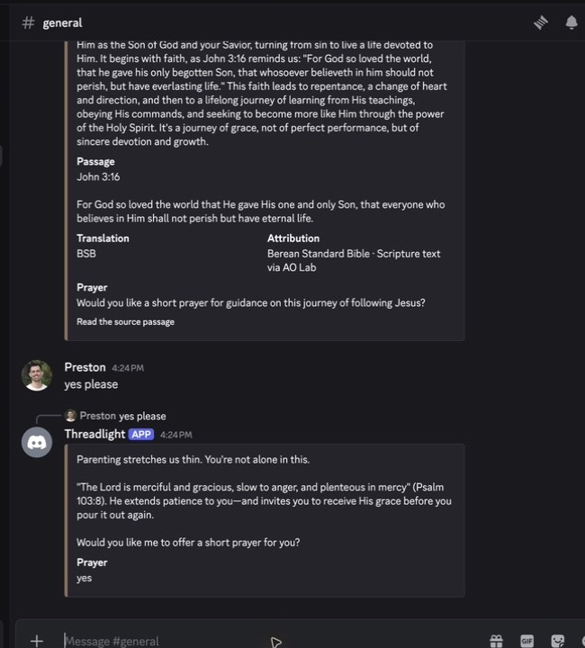

# Deployed Discord Conversation Continuation - 2026-07-30

## Scope

Feature-scoped validation of the deployed Live Tapestry `#general` workflow:

1. Preston sends a parenting reflection request.
2. Threadlight responds in context and offers a short prayer.
3. Preston replies `yes please`.
4. Threadlight writes the promised contextual prayer instead of repeating the offer.

The authenticated Discord desktop session on this machine supplied the user messages. The
Railway-hosted Threadlight runtime supplied the responses.

## Environment

| Field | Value |
| --- | --- |
| Environment | Railway production |
| Deployment | `0ea9ea02-6ee3-49ca-9940-24b7a4a7ca79` |
| Deployment status | `SUCCESS` |
| Discord | Live Tapestry `#general` |
| Participation mode | Active |
| Provider trace | `gloo + ao-lab` |

The active deployment predates the local, uncommitted conversation-history implementation. This
run therefore distinguishes local checkout proof from deployed behavior.

## Results

| Acceptance criterion | Result | Evidence |
| --- | --- | --- |
| Latest parenting message controls the response topic | Failed | Threadlight answered the prior participant's question about following Jesus and selected John 3:16. |
| Threadlight offers prayer after the reflection | Passed, but for the wrong topic | It offered prayer for guidance in following Jesus rather than parenting patience. |
| `yes please` continues the immediately preceding prayer offer | Failed | Threadlight returned a new parenting reflection and asked whether Preston wanted prayer again. |
| Production activity records both exchanges | Passed | Both inputs have `observed` and `responded` events using `gloo + ao-lab`. |

The seed response completed in `16,621 ms`. The follow-up response completed in `11,095 ms`.

## Local Supporting Checks

The current checkout's focused provider and Discord tests passed: four files and 24 tests. Provider
and server typechecks also passed. Those checks validate the uncommitted implementation locally;
they do not prove the active Railway image contains it.

## Conclusion

`FAIL - FEATURE-SCOPED` for the deployed Discord conversation-continuation story. The result
confirms both defects addressed by the local implementation:

- flattened history can carry a prior participant's topic into the current response;
- Threadlight's embed-based prayer offer is absent from the next-turn context.

No application code, production configuration, credentials, permissions, or deployment state was
changed during this test. The only external mutations were the two operator-approved Discord test
messages.
