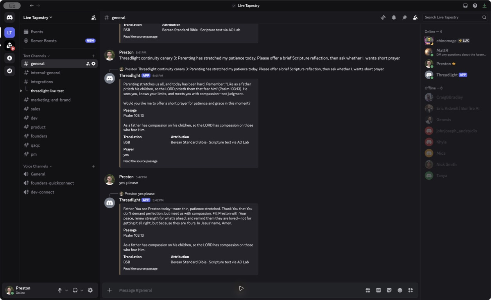

# Deployed Discord Conversation Continuation - 2026-07-30

## Scope

Feature-scoped validation of the deployed Live Tapestry `#general` workflow:

1. Preston sends a parenting reflection request.
2. Threadlight responds in context and offers a short prayer.
3. Preston replies `yes please`.
4. Threadlight writes the promised contextual prayer instead of repeating the offer.

The authenticated Discord desktop session on this machine supplied the user messages. The
Railway-hosted Threadlight runtime supplied the responses.

## Initial Production Failure

| Field | Value |
| --- | --- |
| Environment | Railway production |
| Deployment | `0ea9ea02-6ee3-49ca-9940-24b7a4a7ca79` |
| Deployment status | `SUCCESS` |
| Discord | Live Tapestry `#general` |
| Participation mode | Active |
| Provider trace | `gloo + ao-lab` |

| Acceptance criterion | Result | Evidence |
| --- | --- | --- |
| Latest parenting message controls the response topic | Failed | Threadlight answered the prior participant's question about following Jesus and selected John 3:16. |
| Threadlight offers prayer after the reflection | Passed, but for the wrong topic | It offered prayer for guidance in following Jesus rather than parenting patience. |
| `yes please` continues the immediately preceding prayer offer | Failed | Threadlight returned a new parenting reflection and asked whether Preston wanted prayer again. |
| Production activity records both exchanges | Passed | Both inputs have `observed` and `responded` events using `gloo + ao-lab`. |

The seed response completed in `16,621 ms`. The follow-up response completed in `11,095 ms`.

## Repair

The repair bounds Discord history to the ten messages preceding the triggering message, preserves
reply-chain ownership, marks the current author and current turn explicitly, removes full
Threadlight passage embeds from model context, and gives the current topic priority over older
participants. A brief affirmative reply is recognized only when it belongs to the recipient of
Threadlight's immediately preceding prayer offer.

The live retry exposed a second edge case: an explicit request to "ask whether I want a short
prayer" could still produce the prayer immediately. The provider-neutral continuation policy now
distinguishes a requested invitation from an accepted invitation. Gloo and OpenAI both retry once
when structured output violates either contract.

## Post-Repair Production Verification

| Field | Value |
| --- | --- |
| Source revision | `8b5d3c8152efefbd105e683981708cbb2f2e5374` |
| Railway deployment | `08674910-2067-4f00-9c17-7320829499ad` |
| Image digest | `sha256:6d01d97653bbb4206c8ce6ac07942a88570ce5042f26a0fd246c08d6eaaada0d` |
| Deployment status | `SUCCESS` |
| Discord | Live Tapestry `#general` |
| Participation mode | Active |
| Provider trace | `gloo + ao-lab` |

The deployed acceptance used this two-turn story:

1. `Threadlight continuity canary 3: Parenting has stretched my patience today. Please offer a brief Scripture reflection, then ask whether I want a short prayer.`
2. `yes please`

| Acceptance criterion | Result | Evidence |
| --- | --- | --- |
| Latest parenting message controls the response topic | Passed | Threadlight stayed on parenting patience and selected Psalm 103:13 rather than the prior participant's topic. |
| Threadlight asks permission before praying | Passed | The first response asked, "Would you like me to offer a short prayer for patience and grace in this moment?" |
| Standalone `yes please` continues the offer | Passed | The next response opened "Father, You see Preston today" and delivered the promised contextual prayer without repeating the invitation. |
| Production activity records both exchanges | Passed | Both inputs were observed, queued, and answered with `gloo + ao-lab`; no error event was emitted for the story. |

The seed response completed in `13,729 ms`. The follow-up prayer completed in `17,916 ms`.

## Local Supporting Checks

Focused provider coverage passed 18 tests across the shared conversation policy, Gloo, and OpenAI.
The provider and server typechecks and builds passed. Repository lint checked 113 files, and
`git diff --check` passed before the release.

## Conclusion

`PASS - FEATURE-SCOPED` for the deployed Discord conversation-continuation story. This is direct
hosted evidence for the two tested turns, not a claim of broad pastoral-quality coverage.

The release replaced application code only. No production credentials, provider selections,
permissions, OAuth configuration, or persistent-volume attachments changed. The external test
mutations were the operator-approved Discord canary messages.
