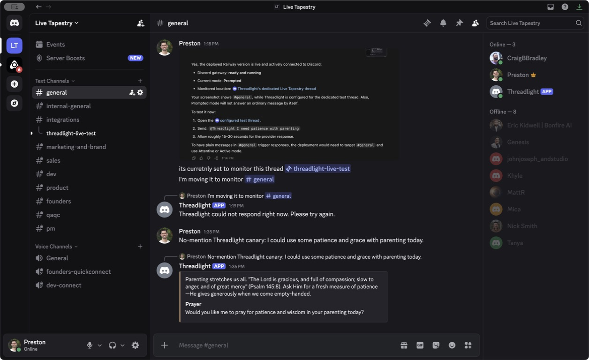

# Discord Active-Mode Reliability - 2026-07-30

## Scope

Resolve a production Discord response failure and prove that Threadlight automatically responds
to a plain, unmentioned message in the configured Live Tapestry `#general` channel while running
in Active mode.

## Failure Diagnosis

At `2026-07-30T18:19:32Z`, production observed and queued a plain `#general` message, then recorded
an error about seven seconds later. Discord delivery was healthy because Threadlight successfully
posted its generic fallback. Protected provider previews also succeeded before remediation, so the
failure was isolated to a transient Gloo generation or parsing path rather than channel selection,
Message Content Intent, or Discord posting permissions.

The previous catch path erased the underlying failure class. It has been replaced with public-safe
phase and category diagnostics that never include provider response bodies, credentials, or raw
exception text.

## Implementation

- Gloo discernment and reply generation now receive one bounded retry for retryable network,
  timeout, rate-limit, server, empty-response, malformed-JSON, and schema failures.
- Authentication and deterministic client errors fail immediately.
- Discord runtime failures are classified by `generation` or `posting` phase and a sanitized
  category.
- `railway.json` pins production builds to the repository Dockerfile.

## Local Proof

| Check | Result |
| --- | --- |
| Focused Vitest | 3 files passed; 21 tests passed |
| Provider typecheck | Passed |
| Server typecheck | Passed |
| Provider build | Passed |
| Server build | Passed |
| Focused Biome check | Passed |
| `git diff --check` | Passed |

Focused tests cover malformed structured output followed by success, HTTP `503` followed by
success, non-retryable HTTP `401`, sanitized Discord failure categories, and all three participation
modes.

## Production Proof

| Field | Evidence |
| --- | --- |
| Source revision | `481e65e6e0172a34c122d8401e378d74a21fd0d8` |
| Railway deployment | `0ea9ea02-6ee3-49ca-9940-24b7a4a7ca79` |
| Deployment status | `SUCCESS` |
| Runtime | One running replica with the persistent `/data` volume ready |
| Discord destination | Live Tapestry `#general` |
| Participation mode | Active (`high`) |
| Control boundary | Unauthenticated `/api/control/status` returned `401` |

At `2026-07-30T18:35:43Z`, Preston sent this plain message without mentioning Threadlight:

> No-mention Threadlight canary: I could use some patience and grace with parenting today.

The public production ledger recorded `observed`, then `queued` with the reason
`Queued for an active-mode response.` At `2026-07-30T18:36:03Z`, it recorded `responded` after
`18,961 ms` using `gloo + ao-lab`. Discord visibly displayed Threadlight's reply with a Psalm 145:8
reflection and a prayer prompt.

## Proof Boundary

This run proves the focused provider and Discord regressions locally, the exact Railway release,
production readiness and access control, and one real no-mention Active-mode response in
Live Tapestry `#general`. It does not claim a complete repository suite, broad provider reliability,
or new YouTube behavior.

No credentials, OAuth settings, Discord permissions, database state, or volume attachments were
changed. The operator-approved destination and Active participation mode remain persisted in the
existing Railway volume.
